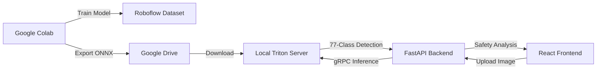

# E-Waste Detection System (Project Antigravity)

**Principal AI Solutions Architect**: E-Waste Detection Team

## Overview

E-Waste Detection System is a high-performance AI-powered platform for detecting and classifying electronic waste. It uses **EfficientDet-D5** trained on the **UNU-KEYS E-Waste Dataset (77 classes)** with a hybrid cloud training / local inference architecture.

### Key Features

- **77 E-Waste Classes**: Detects batteries, circuit boards, displays, processors, and 73 other e-waste categories
- **Hybrid Architecture**: Cloud training on Google Colab + Roboflow, local inference via NVIDIA Triton
- **Hazardous Material Detection**: Automatically flags dangerous items (lithium batteries, CRT monitors, etc.)
- **High Performance**: Sub-50ms inference latency with gRPC communication to Triton Server
- **Safety Interlock**: Real-time hazardous waste detection (>40% confidence) triggers safety protocols
- **Production Ready**: FastAPI backend with structured logging, health checks, and retry logic

## Architecture



## Dataset & Training

- **Dataset**: UNU-KEYS E-Waste Dataset (77 classes, COCO format)
- **Source**: Roboflow
- **Model**: EfficientDet-D5 (compound coefficient: 5)
- **Training Platform**: Google Colab (GPU: T4/A100)
- **Training Time**: 4-8 hours
- **Output**: ONNX model for Triton deployment

See [`training/How_To_Train.md`](training/How_To_Train.md) for detailed training instructions.

## Setup Guide

### Prerequisites

- **Hardware**: GPU recommended (NVIDIA RTX 4060 or better)
- **Software**: Docker & Docker Compose, Python 3.10+, Node.js 18+
- **Accounts**: Roboflow account with API key (for training)

### 1. Clone & Configure

```bash
git clone <repository-url>
cd untrashify-main
cp .env.example .env
```

### 2. Get Trained Model

**Option A: Use Pre-trained Model** (if available)
```bash
# Place model in Triton repository
cp path/to/model.onnx triton_model_repo/efficientdet_d5/1/model.onnx
```

**Option B: Train Your Own Model**
1. Follow [`training/How_To_Train.md`](training/How_To_Train.md) to train on Google Colab
2. Download trained model from Google Drive
3. Transfer using: `python training/transfer_model.py ~/Downloads/model.onnx`

### 3. Start Services

```bash
# Start Triton Inference Server + Backend
docker-compose up --build
```

Verify Triton loaded the model:
```bash
# Check logs for:
# "Successfully loaded 'efficientdet_d5'"
docker logs untrashify-triton
```

### 4. Run Frontend

```bash
cd frontend
npm install
npm run dev
```

Access the application at `http://localhost:5173`

## E-Waste Classes (77 Total)

The system detects 77 categories of electronic waste:

**Hazardous Items** (35 classes):
- Batteries: `battery`, `battery_lithium`, `battery_alkaline`, `battery_lead_acid`
- Displays: `crt_monitor`, `tv_crt`, `display_lcd`, `display_oled`
- Circuit Boards: `circuit_board`, `pcb_bare`, `motherboard`, `graphics_card`
- Storage: `hard_drive`, `ssd`, `RAM`, `ROM`, `flash_memory`
- Devices: `laptop`, `desktop_computer`, `phone_mobile`, `tablet`, `server`
- And more...

**Non-Hazardous Items** (42 classes):
- Components: `resistor`, `capacitor`, `led`, `switch`, `button`
- Peripherals: `keyboard`, `mouse`, `speaker`, `headphone`, `webcam`
- Cables: `cable`, `wire`, `connector`
- And more...

See [`docs/EWASTE_CLASSES.md`](docs/EWASTE_CLASSES.md) for the complete list with recycling guidelines.

## API Usage

### Detect E-Waste

```bash
curl -X POST http://localhost:8000/detect \
  -F "file=@ewaste_image.jpg"
```

**Response:**
```json
{
  "detections": [
    {
      "class": "battery_lithium",
      "confidence": 0.92,
      "bbox": [120, 45, 200, 180],
      "hazardous": true
    }
  ],
  "is_hazardous": true,
  "processing_time_ms": 34
}
```

### Health Check

```bash
curl http://localhost:8000/health
```

## Configuration

Edit `.env` to customize:

```bash
# Model Settings
MODEL_NAME=efficientdet_d5
HAZARDOUS_THRESHOLD=0.40

# Hazardous Classes (triggers safety alerts)
HAZARDOUS_CLASSES=["battery_lithium","crt_monitor","circuit_board"]

# Triton Server
TRITON_GRPC_URL=triton:8001
```

## Security & Performance

- **Input Validation**: Max file size 10MB
- **Async Inference**: Non-blocking threadpool execution
- **Request Tracing**: Unique `X-Request-ID` for debugging
- **Health Monitoring**: Deep Triton server health checks
- **Structured Logging**: JSON logs for observability

## Technology Stack

- **Backend**: FastAPI, Python 3.10+
- **Inference**: NVIDIA Triton Inference Server (ONNX Runtime)
- **Frontend**: React, Vite, TailwindCSS
- **Model**: EfficientDet-D5 (77 classes)
- **Training**: Google Colab, PyTorch, Roboflow
- **Deployment**: Docker, Docker Compose

## License

Confidential - Project Antigravity E-Waste Detection System
